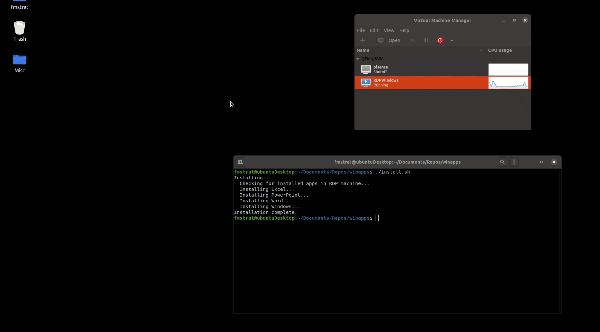

#WinApps - Linux KVM+RDP

Execute aplicativos do Windows como Microsoft Office/Adobe no Linux (Ubuntu/Fedora) e GNOME/KDE como se fossem parte do sistema operacional nativo, incluindo integração com o Nautilus para clicar com o botão direito do mouse em arquivos de tipos MIME específicos para abri-los.



## instalação

Passo-a-passo para:
```
git clone https://github.com/madson7/vagrant-ex.git

cd vagrant-ex/windows/

git clone https://github.com/Fmstrat/winapps.git

vagrant up
```

Defina uma senha para o usuário vagrant usando o virt-manager

Para testar a conexão você pode usar o seguinte comando:
```
xfreerdp /d: /u:vagrant /p:PASSWORD /v:IPADDRESS
```
Em seguida crie um aquivo de conexão:

```
mkdir -p ~/.config/winapps

cat &gt;&gt; ~/.config/winapps/winapps.conf <<EOF
RDP_USER="vagrant"
RDP_PASS="PASSWORD"
RDP_DOMAIN="windows_default"
RDP_IP="IPADDRESS"
#RDP_SCALE=100
#RDP_FLAGS=""
#MULTIMON="true"
#DEBUG="true"
EOF
```
Por fim instale o WinApps:
```
./winapps/installer.sh --user
```